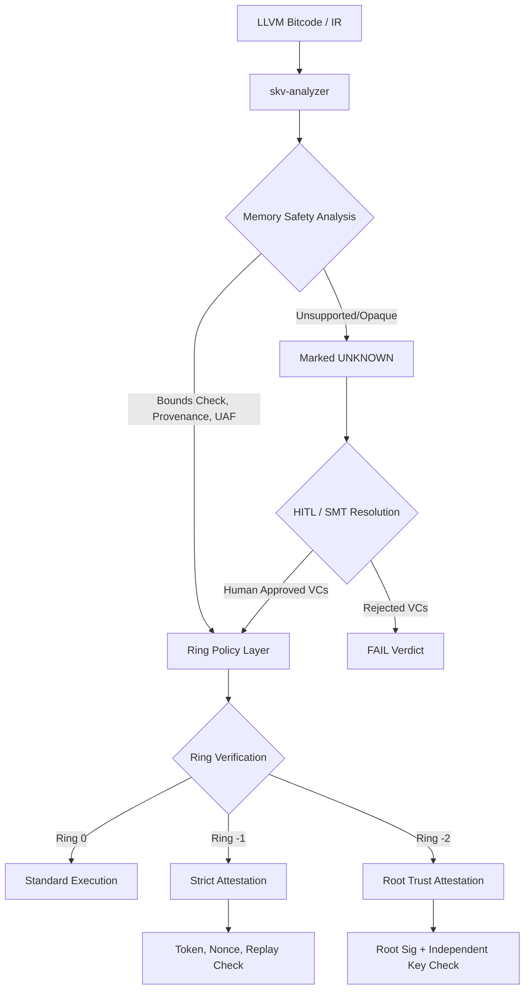

# Sentinel-KV: Security-Focused LLVM IR Analyzer

> [!NOTE]
> `sentinel-skv` is a security-focused LLVM IR analyzer designed for strict attestation, determinism, and ring policy enforcement in kernel and bare-metal environments. It functions as an essential pipeline component for enforcing secure software development lifecycles.

**Project Name:** `sentinel-skv`  
**CLI Binary:** `skv-analyzer`

`sentinel-skv` combines:
- Static memory-safety checks over LLVM IR via SMT solvers.
- Signed attestation validation (including replay and freshness controls).
- Ring-aware fail-closed trust policies (`ring0`, `ring-1`, `ring-2`).
- Machine-readable JSON outputs for Continuous Integration (CI) and Security Information and Event Management (SIEM).
- An interactive Terminal UI for operational efficiency.

---

## Architectural Overview

The Sentinel-KV pipeline employs a zero-trust model from compilation through execution. The system applies progressive verification phases before allowing kernel or ring-level execution.



---

## Security Model

### 1. LLVM and Z3 Analysis Layer

The core analysis engine scans LLVM IR to formally verify memory safety operations, specifically checking for:
- **Allocation Provenance:** Validating `kmalloc`, `kzalloc`, and `kcalloc`.
- **Bounds Checking:** Ensuring safe bounds for `load`, `store`, `memcpy`, and `memset`.
- **Temporal Memory Safety:** Checking use-after-free (UAF) and double-free conditions via `kfree`.
- **Pointer Tracking:** Resolving pointer origin through `GEP`, `bitcast`, `ptrtoint`, `inttoptr`, and pointer arithmetic.

> [!WARNING]
> **Fail-Closed Architecture**  
> Any unsupported assembly patterns or unresolvable pointer tracking structures are strictly evaluated as `UNKNOWN`. These are never silently treated as safe.

### 2. Ring Policy Layer

Sentinel-KV enforces strict environmental boundaries based on target runtime rings:
- **`ring0`**: Standard verdict behavior; default environment rules apply.
- **`ring-1`**: Strict Mode enabled. Any `UNKNOWN` states are promoted to an automatic `FAIL`.
- **`ring-2`**: Maximum Security Strict Mode. Promotes `UNKNOWN` to `FAIL` and mandates independent hardware root trust requirements.

### 3. Attestation Trust Layer

For `ring-1` and `ring-2`, security policies mandate signed token validation:
- Detached Ed25519 signature over the token.
- Key fingerprint pinning (SHA-256 hex).
- Freshness verification via Unix timestamps and max-age policies.
- Cryptographic Nonce binding.
- Replay counters featuring atomic updates and secure filesystem locks.
- Secure file checks ensuring appropriate owner UIDs and no group/world write permissions.

> [!IMPORTANT]
> **Ring-2 Exclusives**  
> Operations classified as `ring-2` require a `root_attested:true` token field and a separate, independent root signature and fingerprint path.

---

## Architectural Determinism (HITL & SMT)

Sentinel-KV incorporates a determinism pipeline in which AI assistants are explicitly untrusted. 

1. **Tier 1 (Untrusted AI Assistant):** Proposes candidate invariants or ownership hints. It cannot commit proof obligations.
2. **Tier 2 (Human Security Gate):** Human reviewers act as the ultimate arbiter, accepting, modifying, or rejecting AI candidates. Only approved Verification Conditions (VCs) proceed.
3. **Tier 3 (Absolute Verifier):** The Z3 SMT solver validates the approved VCs and emits proof artifacts. The load-time checker consumes these proofs deterministically.

---

## Setup and Installation

### Requirements
- Rust Toolchain (1.80+)
- C Compiler (for the default attestation bridge)
- LLVM 19 binaries and headers (`llvm-config` required in PATH)
- System libraries for Z3 and LLVM bindings

### Building the Project

```bash
cargo build --release
```

### Backends

The attestation bridge backend can be configured at build time:
- **Default:** C backend (`src/c/attestation_bridge.c`)
- **Optional:** Zig backend (`src/zig/attestation_bridge.zig`)

To select the Zig backend:
```bash
SKV_ATTESTATION_IMPL=zig cargo build --release
```

> [!NOTE]
> If Zig is selected but unavailable on the host system, the build pipeline will fall back to the C backend and emit a warning.

---

## Command Line Interface

```bash
skv-analyzer [OPTIONS] [IR_PATH] [COMMAND]
```

### Commands
- `features` — Displays a full inventory of available features.
- `doctor` — Executes runtime and backend diagnostics.
- `token-template` — Generates attestation token templates for quick bootstrapping.
- `tui` — Launches the interactive terminal menu.
- `attest-check` — Performs attestation and ring policy validation without parsing LLVM IR.

### Selected Options
- `--ring <ring0|ring-1|ring-2>`
- `--attestation-token <path>`
- `--hitl-mode <off|require>`
- `--hitl-approvals <path>` (newline-delimited VC IDs)
- `--runtime-fallback <auto|arm-mte|software-targeted>`
- `--json`
- `--verdict-out <path>`

---

## Output and Exit Codes

Verdicts generated by `skv-analyzer` determine the system exit codes, allowing for stable CI/CD integration.

**Exit Codes:**
- `0` — Pass
- `10` — Fail
- `20` — Unknown
- `1` — Runtime/Internal Error
- `12` — Doctor command failed required checks

> [!TIP]
> Use the `--json` flag along with `--verdict-out <path>` to emit structured security reports for automated SIEM consumption. Files generated this way enforce a `0600` permission mask.

---

## Code Review Index

- **Analyzer Core:** `src/main.rs` -> `analyze()`, `check_access()`
- **Build Backend Selection:** `build.rs` -> `compile_c()`, `compile_zig()`
- **HITL Verification Gate:** `src/main.rs` -> `HitlGate`, `enforce_hitl_policy()`
- **Attestation & Cryptography:** `src/main.rs` -> `verify_attestation_signature()`
- **C ABI Contract:** `src/c/attestation_bridge.h`
