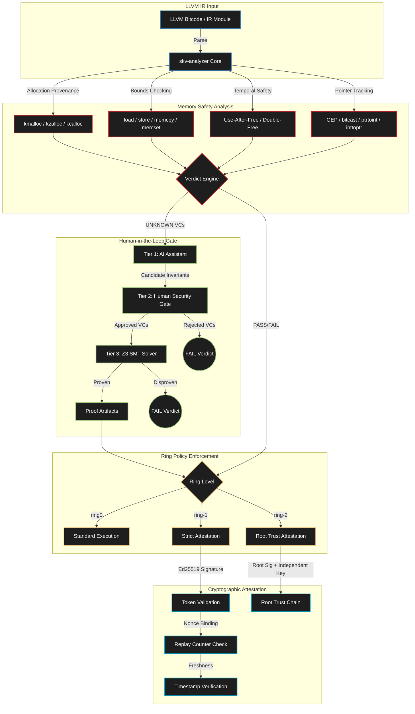

# Sentinel-KV

### Security-Focused LLVM IR Analyzer with Ring-Aware Attestation

<p align="center">
  
  
  
  
  
</p>

Sentinel-KV (`skv-analyzer`) is a security-focused LLVM IR analyzer designed for strict attestation, determinism, and ring policy enforcement in kernel and bare-metal environments. It combines static memory-safety checks over LLVM IR via SMT solvers, signed attestation validation, and ring-aware fail-closed trust policies — functioning as an essential pipeline component for enforcing secure software development lifecycles.

---

## What is Sentinel-KV? (The Simple Version)

Before a kernel module or driver can be loaded into the Linux kernel, someone needs to verify it is safe. Traditionally, this means code review, testing, and hoping nothing was missed.

**Sentinel-KV automates this with mathematical proof.** It takes the LLVM Intermediate Representation (IR) of a kernel module and:

1. **Analyzes** every memory operation — allocations, pointer arithmetic, bounds checks, use-after-free patterns
2. **Proves** safety using the Z3 SMT solver — not testing, not fuzzing, but mathematical proof
3. **Enforces** ring-based trust policies — Ring 0 is standard, Ring -1 requires cryptographic attestation, Ring -2 requires independent root trust
4. **Gates** all AI assistance through a Human-in-the-Loop (HITL) verification pipeline — AI proposes invariants, humans approve, Z3 verifies absolutely

If any memory operation cannot be proven safe, Sentinel-KV marks it `UNKNOWN`. In Ring -1 mode, `UNKNOWN` is automatically promoted to `FAIL`. No unsafe code passes the gate.

> [!IMPORTANT]
> Sentinel-KV incorporates a determinism pipeline in which **AI assistants are explicitly untrusted**. AI can propose candidate invariants, but only human-approved Verification Conditions (VCs) proceed to the Z3 solver. The system is designed to prevent AI hallucinations from compromising kernel safety.

---

## How It Works (Technical Deep Dive)

Sentinel-KV operates as a multi-phase verification pipeline, progressively narrowing the trust boundary from raw LLVM IR down to cryptographically signed proof artifacts.

### Architecture



### The Three-Tier Verification Model

Sentinel-KV enforces architectural determinism through a strict trust hierarchy:

**Tier 1 — Untrusted AI Assistant**
- Proposes candidate invariants and ownership hints for `UNKNOWN` memory operations
- Cannot commit proof obligations
- All proposals are treated as untrusted suggestions

**Tier 2 — Human Security Gate**
- Human reviewers act as the ultimate arbiter
- Accept, modify, or reject AI candidate Verification Conditions
- Only approved VCs proceed to the formal solver

**Tier 3 — Absolute Verifier (Z3 SMT)**
- Validates approved VCs using the Z3 theorem prover
- Emits machine-checkable proof artifacts
- The load-time checker consumes these proofs deterministically

> [!NOTE]
> This pipeline is specifically designed to prevent AI hallucinations from compromising kernel safety. The AI is a _tool_, not a _decision maker_. Humans gate all proof obligations.

### LLVM IR Analysis Layer

The core analysis engine scans LLVM IR to formally verify memory safety:

| Analysis Category | Operations Checked | Failure Mode |
|:-----------------|:------------------|:-------------|
| Allocation Provenance | `kmalloc`, `kzalloc`, `kcalloc` | Missing provenance = UNKNOWN |
| Bounds Checking | `load`, `store`, `memcpy`, `memset` | Out-of-bounds = FAIL |
| Temporal Safety | `kfree` double-free, use-after-free | UAF/double-free = FAIL |
| Pointer Tracking | `GEP`, `bitcast`, `ptrtoint`, `inttoptr` | Unresolvable origin = UNKNOWN |

> [!WARNING]
> **Fail-Closed Architecture:** Any unsupported assembly patterns or unresolvable pointer tracking structures are strictly evaluated as `UNKNOWN`. These are never silently treated as safe.

### Ring Policy Layer

Sentinel-KV enforces strict environmental boundaries based on target runtime rings:

| Ring Level | Behavior | Trust Requirement |
|:-----------|:---------|:-----------------|
| `ring0` | Standard verdict behavior | Default environment rules |
| `ring-1` | Strict Mode — `UNKNOWN` promoted to `FAIL` | Ed25519 signed attestation token |
| `ring-2` | Maximum Security — `UNKNOWN` promoted to `FAIL` | Independent root trust + separate key chain |

### Attestation Trust Layer

For `ring-1` and `ring-2`, security policies mandate signed token validation:
- Detached Ed25519 signature over the token
- Key fingerprint pinning (SHA-256 hex)
- Freshness verification via Unix timestamps and max-age policies
- Cryptographic nonce binding
- Replay counters with atomic updates and secure filesystem locks
- Secure file checks ensuring appropriate owner UIDs and no group/world write permissions

> [!CAUTION]
> **Ring-2 Exclusives:** Operations classified as `ring-2` require a `root_attested:true` token field and a separate, independent root signature and fingerprint path. This provides cryptographic proof of chain-of-custody from hardware root of trust.

---

## Features

| Feature | Description |
|:--------|:-----------|
| LLVM IR Memory Analysis | Allocation provenance, bounds checking, UAF, double-free detection |
| Z3 SMT Verification | Mathematical proof of memory safety via theorem proving |
| Ring-Aware Policies | `ring0` / `ring-1` / `ring-2` fail-closed trust enforcement |
| Ed25519 Attestation | Signed token validation with nonce, replay, and freshness checks |
| HITL Verification Gate | AI proposes, human approves, Z3 verifies — no shortcuts |
| Interactive TUI | Terminal menu for diagnostics, features, and token generation |
| Machine-Readable JSON | Structured outputs for CI/CD and SIEM integration |
| C and Zig Backends | Attestation bridge with configurable build-time backend selection |
| Stable Exit Codes | `0`=Pass, `10`=Fail, `20`=Unknown, `1`=Error for CI pipelines |
| Doctor Diagnostics | Runtime and backend health checks via `skv-analyzer doctor` |

---

## Getting Started

### Prerequisites

- Rust Toolchain (1.80+)
- LLVM 19 binaries and headers (`llvm-config` required in PATH)
- C Compiler (for the default attestation bridge)
- Z3 and LLVM system libraries

### Building

```bash
cd skv-analyzer
cargo build --release
```

**Optional Zig backend:**
```bash
SKV_ATTESTATION_IMPL=zig cargo build --release
```

> [!NOTE]
> If Zig is selected but unavailable on the host system, the build pipeline falls back to the C backend and emits a warning.

---

## Command Line Interface

```bash
skv-analyzer [OPTIONS] [IR_PATH] [COMMAND]
```

### Commands

| Command | Description |
|:--------|:-----------|
| `features` | Display full inventory of available features |
| `doctor` | Execute runtime and backend diagnostics |
| `token-template` | Generate attestation token templates for quick bootstrapping |
| `tui` | Launch interactive terminal menu |
| `attest-check` | Perform attestation and ring policy validation without parsing LLVM IR |

### Selected Options

| Option | Description |
|:-------|:-----------|
| `--ring <ring0\|ring-1\|ring-2>` | Target ring policy level |
| `--attestation-token <path>` | Path to signed attestation token |
| `--hitl-mode <off\|require>` | Human-in-the-loop verification gate |
| `--hitl-approvals <path>` | Newline-delimited approved VC IDs |
| `--runtime-fallback <auto\|arm-mte\|software-targeted>` | Fallback policy selection |
| `--json` | Machine-readable JSON output |
| `--verdict-out <path>` | Write structured verdict to file (0600 permissions) |

---

## Usage Examples

### Full Analysis Run (IR + Policy)

```bash
skv-analyzer path/to/module.ll --ring ring0
```

### Ring-2 Attestation Validation

```bash
skv-analyzer --ring ring-2 \
  --attestation-token token.txt \
  --attestation-max-age-sec 300 \
  --attestation-nonce "$NONCE" \
  --attestation-replay-state replay.state \
  --attestation-pubkey attest.pub.b64 \
  --attestation-signature attest.sig.b64 \
  --attestation-key-fingerprint "$ATTEST_FP" \
  --ring2-root-pubkey root.pub.b64 \
  --ring2-root-signature root.sig.b64 \
  --ring2-root-key-fingerprint "$ROOT_FP" \
  --json attest-check
```

### Interactive TUI

```bash
skv-analyzer tui
```

**Shortcuts:** `d` = Doctor, `f` = Features, `j` = Ring-2 token template, `q` = Quit

---

## Exit Codes

Verdicts determine system exit codes for stable CI/CD integration:

| Code | Meaning |
|:-----|:--------|
| `0` | Pass — all checks satisfied |
| `10` | Fail — memory safety violation detected |
| `20` | Unknown — unresolvable analysis result |
| `1` | Runtime/Internal error |
| `12` | Doctor command failed required checks |

> [!TIP]
> Use `--json` with `--verdict-out <path>` to emit structured security reports for automated SIEM consumption. Files generated this way enforce a `0600` permission mask.

---

## Project Structure

```
sentinel-kv/
├── skv-analyzer/                  # Main analyzer crate
│   ├── src/
│   │   ├── main.rs                # Core analyzer (112K+) — LLVM IR parsing,
│   │   │                          #   Z3 verification, HITL gate, ring policy,
│   │   │                          #   attestation, TUI, JSON output
│   │   ├── c/
│   │   │   ├── attestation_bridge.c   # C attestation backend (replay, nonce, locks)
│   │   │   └── attestation_bridge.h   # External C ABI contract
│   │   └── zig/
│   │       └── attestation_bridge.zig # Optional Zig attestation backend
│   ├── llvm-ir-patched/           # Patched LLVM IR bindings
│   │   └── build.rs              # Build script for LLVM C API integration
│   ├── build.rs                   # Backend selection (C vs Zig)
│   └── Cargo.toml
├── tests/                         # Integration test cases
└── README.md
```

---

## Code Review Index (A-Z)

This index provides a comprehensive map for security audits:

| Letter | Component | Location |
|:-------|:----------|:---------|
| A | Analyzer core (LLVM + Z3) | `src/main.rs` — `analyze`, `check_access`, `infer_gep_offset` |
| B | Build backend selection | `build.rs` — `compile_c`, `compile_zig` |
| C | Command surface | `src/main.rs` — `Args`, `Commands` |
| D | Doctor diagnostics | `src/main.rs` — `run_doctor` |
| E | Exit codes + verdict model | `src/main.rs` — `Verdict`, `verdict_from_result` |
| F | Feature catalog output | `src/main.rs` — `print_feature_catalog` |
| G | Guarded parser path | `src/main.rs` — panic trapping in `Module::from_ir_path` |
| H | HITL verification gate | `src/main.rs` — `HitlGate`, `enforce_hitl_policy` |
| I | Integrity of attestation signatures | `src/main.rs` — `verify_attestation_signature` |
| J | JSON outputs for automation | `src/main.rs` — `Verdict::to_json` |
| K | Key and file security checks | `src/main.rs` — `ensure_secure_owned_file` |
| L | Load-time attestation gate | `src/main.rs`, `src/c/attestation_bridge.h` |
| M | Monotonic replay protection | `src/c/attestation_bridge.c` — atomic locks |
| N | Nonce binding | `src/main.rs`, `src/c/attestation_bridge.c` |
| O | Operational TUI | `src/main.rs` — `run_tui` |
| P | Pointer provenance tracking | `src/main.rs` — `PtrVal`, `IntVal` handlers |
| Q | Quick token generation | `src/main.rs` — `print_token_template` |
| R | Ring policy enforcement | `src/main.rs` — `apply_ring_policy` |
| S | Secure token/replay validation | `src/c/attestation_bridge.c` |
| T | Timestamp freshness checks | `src/main.rs`, `src/c/attestation_bridge.c` |
| U | UNKNOWN safety semantics | `src/main.rs` — `mark_unknown` |
| V | VC emission for review workflows | `src/main.rs` — `emit_hitl_vcs` |
| W | Wire-up for runtime fallback | `src/main.rs` — `RuntimeFallbackPolicy` |
| X | External C ABI contract | `src/c/attestation_bridge.h` |
| Y | Automation hooks | `src/main.rs` — stable exit/JSON hooks |
| Z | Zig backend parity | `src/zig/attestation_bridge.zig` |

---

## Architecture and Interoperability Matrix

| Execution Layer | Sentinel Component | Primary Technology & Enforcement | Strategic Objective |
|:------|:------|:------|:------|
| Ring -1 (Hypervisor) | `sentinel-vmi` | AMD-V / NPT Guard / ARMv8 EL2 | Out-of-band Hypervisor Introspection, memory monitoring |
| Ring 0 (Compile) | `telos-lang` | Rust / LLVM / Z3 SMT | Intent-to-eBPF compiler with formal verification |
| Ring 0 (Runtime) | `telos-runtime` | eBPF-LSM | Intent correlation, Information Flow Control (IFC), and Taint Tracking |
| **Verification** | **`sentinel-kv`** | LLVM IR / Z3 / Ed25519 | Static memory-safety analysis, ring-aware attestation |
| Wire / Physical NIC | `hyperion-xdp` | XDP / eBPF | Wire-speed network drop and proxy enforcement |

---

## Development

```bash
cd skv-analyzer

cargo check --quiet     # Type-check
cargo test --quiet      # Run all tests
cargo build --release   # Production build

# Quick diagnostics
skv-analyzer doctor
skv-analyzer features
skv-analyzer --json features
```

---

## License

MIT License — see [LICENSE](LICENSE).

---

<p align="center">
  <b>Sentinel-KV</b> — <em>Because trust must be proven, not assumed.</em>
</p>